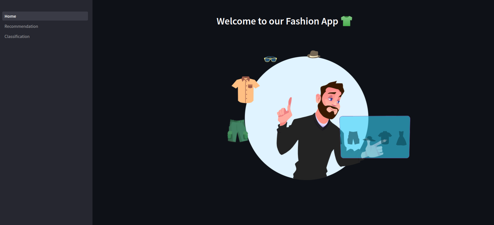

# Fashion Recommender App

## Installation and Running

~~~bash
$ git clone https://github.com/AbdelrahmanAbounida/fashion-recommender.git
$ cd fashion-recommender
$ pip install -r requirements.txt
$ streamlit run 01_Home.py
~~~
